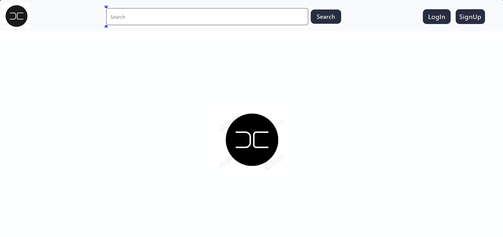
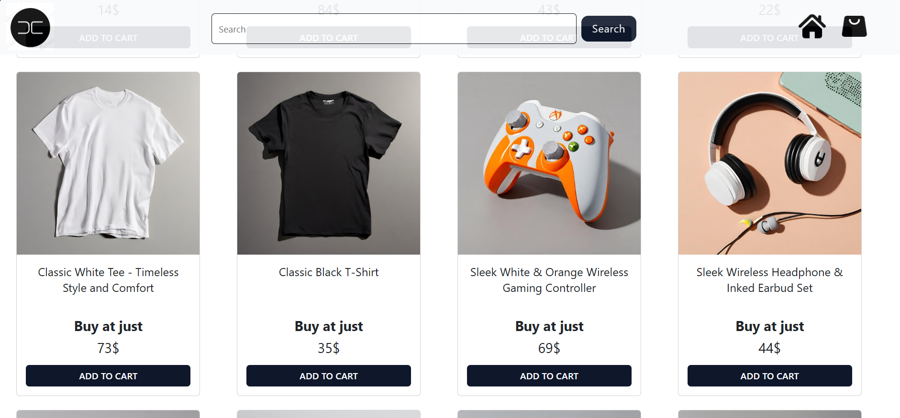
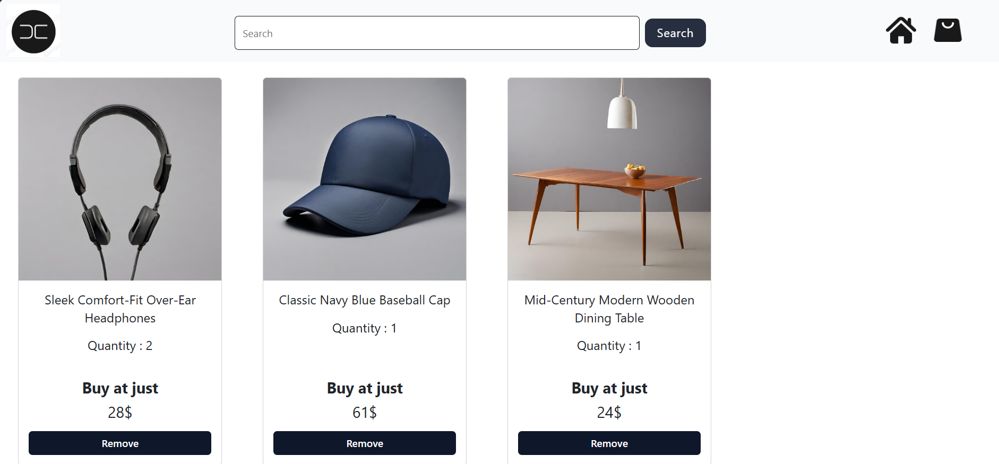
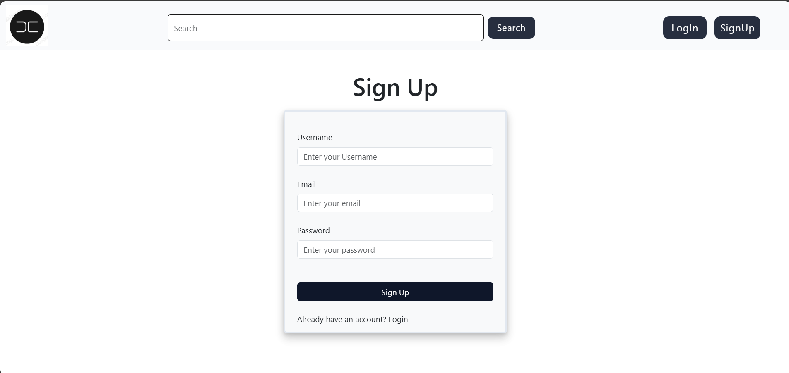

# MERN Stack Shopping Store

A simple, Online Shopping Store (like Myntra) built using the MERN (MongoDB, Express.js, React, Node.js) stack. This allows users to shop items, add items to cart, remove items from the cart and any more...

## Features

- Shop items as you want
- 
- Add your items to the cart.
- 
- Remove items from the cart
- User can SignUp/Login for their Accounts
- 
- Protected password using bcryptJS

## Technology Stack

- **Frontend**: React, Tailwind CSS
- **Backend**: Node.js, Express.js
- **Database**: MongoDB

## Installation

1. Clone the repository:
2. Install dependencies for backend and frontend  (using npm install):
3. Set up environment variables:
4. Start the backend server(npm run dev):
5. In a new terminal, start the frontend using (npm run dev)
6. And visit the given link.

